# 👨‍💻 Varun Poojari | Cybersecurity Enthusiast

[](https://www.linkedin.com/in/varunpoojari/)
[](https://twitter.com/itsVarunPujary)
[](https://varunpoojari.netlify.app)
[](https://academy.hackthebox.com/login)
[](https://tryhackme.com/p/VarunPoojari)

## 🛡️ About Me

Cybersecurity Professional specializing in Malware Analysis, Incident Response, and Security Operations. Currently pursuing B.Tech in Computer Science & Engineering (Cyber Security and Forensics) at MIT World Peace University, Pune.

- 🔍 Security Operations Center (SOC) Analyst
- 🦠 Malware Analysis Enthusiast
- 🚀 DFIR Practitioner
- 🔄 Continuous Learner in Cybersecurity
- 🤖 Automation & SOAR Developer

## 🎯 Expertise

### 🔐 Cybersecurity Domains
```text
Malware Analysis        ███████████░░  90%
Incident Response      ████████░░░░░  70%
Network Security       ████████░░░░░  70%
SIEM Implementation    ███████████░░  90%
Threat Hunting         ████████░░░░░  70%
Digital Forensics      ████████░░░░░  70%
```

## 🛠️ Technical Arsenal

### 🔍 Security Tools & Technologies
<div align="left">
    
    
    
    
</div>

### 🌐 Network Security
<div align="left">
    
    
    
    
</div>

### 🖥️ EDR & Endpoint Security
<div align="left">
    
    
    
    
</div>

### 🎯 SIEM & SOAR
<div align="left">
    
    
    
    
</div>

## 🎓 Certifications & Achievements
<div align="left">
    
    
    
    
    
</div>

## 🚀 Featured Projects

### [Malware Analysis Lab](https://github.com/your-repo)
- 🔬 Automated malware analysis environment
- 📊 Dynamic and static analysis capabilities
- 🤖 Machine learning-based detection
- 🔍 Sandbox integration

### [SOC Automation Project](https://github.com/your-repo)
- 🔄 SOAR implementation with TheHive
- 🤖 Custom playbooks for incident response
- 📊 Automated threat intelligence gathering
- 🎯 Integration with MISP

### [Security Detection Lab](https://github.com/your-repo)
- 🚨 Custom detection rules for SIEM
- 🔍 Log analysis automation
- 📈 Threat hunting procedures
- 🛡️ Security controls testing

## 📈 GitHub Analytics

<p align="center">
    
    
</p>

<p align="center">
    
</p>

## 🎯 Current Focus
- 🔍 Advanced Malware Analysis Techniques
- 🛡️ Threat Hunting Development
- 🤖 Security Automation with Python
- 🔐 Zero Trust Architecture Implementation

## 📫 Connect With Me
For professional inquiries or collaboration opportunities:
- 💼 LinkedIn: [Varun Poojari](https://www.linkedin.com/in/varunpoojari50/)
- 🌐 Website: [Portfolio](https://varunpoojari.netlify.app)
- 📧 Email: varunrpoojari50@gmail.com

---
*"Security is not a product, but a process." - Bruce Schneier*



