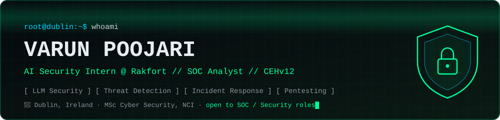
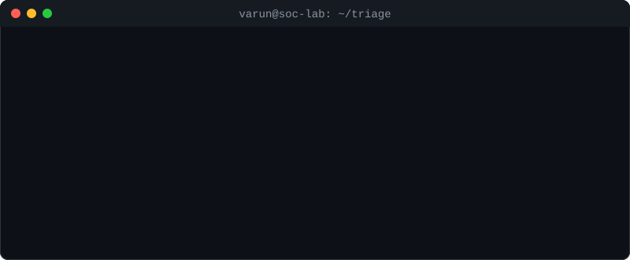

<p align="center">
  
</p>

<p align="center">
  <a href="https://git.io/typing-svg"></a>
</p>

<p align="center">
  <a href="https://www.linkedin.com/in/varunpoojari/"></a>
  <a href="mailto:varunrpoojari@gmail.com"></a>
  <a href="https://tryhackme.com/p/VarunPoojari"></a>
  <a href="https://varunpoojari.netlify.app"></a>
  <a href="https://twitter.com/itsVarunPujary"></a>
</p>

<p align="center">
  
  
  
</p>

---

## `> cat about_me.yaml`

```yaml
name:        Varun Poojari
role:        AI Security Intern @ Rakfort (Dublin)          # Sept 2026 – present
education:
  - MSc Cyber Security — National College of Ireland      # 2025 – 2026, expected 1:1
  - BTech CSE (Cyber Security & Forensics) — MIT-WPU, India # First Class Honours equiv.
focus:
  - Securing AI / LLM systems   # OWASP LLM Top 10, MITRE ATLAS, prompt injection, agent & webhook abuse
  - Security operations         # SIEM triage, IOC/TTP hunting, ATT&CK mapping, incident response
  - Offensive security          # web/API pentesting, vulnerability management
  - Security automation         # Python + LLM-assisted alert triage
currently_learning: [eJPT, CompTIA Security+]
looking_for: Graduate / entry-level Cybersecurity & SOC Analyst roles in Ireland
```

---

## `> ls ./experience`

| When | Where | What |
|:--|:--|:--|
| **Sep 2026 – Now** | 🛡️ **Rakfort**, Dublin — *AI Security Intern* | Assessing LLM apps against the **OWASP LLM Top 10**, mapping risks to **MITRE ATLAS**, testing for prompt injection, data leakage and insecure agent/webhook integrations; building Python automation for LLM-assisted alert triage. |
| **Jul 2024 – Jan 2025** | ⛓️ **Aether Shield Technologies**, Pune — *Cyber Security Intern* | Led a 10-person team building a smart-contract auditing tool integrating 6 open-source frameworks (**+20% delivery speed**); ran security awareness workshops. |

---

## `> ./featured_projects --sort impact`

<table>
<tr>
<td width="50%" valign="top">

### 🧨 [Pentest Suite](https://github.com/Varunpoojari/pentest-suite) · [Live ↗](https://pentest-suite.vercel.app/)
Multi-AI penetration testing framework (OpenAI, Grok-2, Claude, Ollama) automating discovery across **12 modules** — XSS, SQLi, SSRF, RCE.
- Provider-agnostic abstraction layer in **Next.js 14**
- Weighted **0–100 risk-scoring** algorithm
- Live terminal log streaming, <2s page loads

`Next.js` `TypeScript` `Zustand` `LLMs`

</td>
<td width="50%" valign="top">

### 🦠 [Malware Analysis Lab](https://github.com/Varunpoojari/Malware_Analysis_Lab)
Python static-analysis toolkit for suspicious files.
- Handles **50+ file types**, **100+ attributes**
- **YARA** rules + MD5 / SHA1 / SHA256 hashing
- **95% accuracy** flagging malicious executables & encoded commands

`Python` `YARA` `Static Analysis`

</td>
</tr>
<tr>
<td width="50%" valign="top">

### 🍯 [Adaptive AI Honeypot System](https://github.com/Varunpoojari/Adaptive_AI_Honeypot_System)
ML-driven honeypot that adapts to attacker behaviour.
- Real-time monitoring & classification of **100+ attack events**
- Containerised service emulation with configurable services/ports

`Python` `ML` `Docker` `Deception`

</td>
<td width="50%" valign="top">

### 🔍 More from the lab
- [Network IDS using Machine Learning](https://github.com/Varunpoojari/Network-Intrusion-Detection-System-using-Machine-Learning)
- [AI-Powered Phishing Detector](https://github.com/Varunpoojari/AI-powered-phishing-detector)
- [Security Log Analyzer](https://github.com/Varunpoojari/Security-log-analyzer)
- [Stealthy Deepfake Data Acquisition System](https://github.com/Varunpoojari/Stealthy_Deepfake_Data_Acquisition_System) — *published, Springer ICACIS 2024*

</td>
</tr>
</table>

---

## `> nmap -sV ./skills`

<details open>
<summary><b>🚨 Security Operations & Detection</b></summary>
<br/>


</details>

<details open>
<summary><b>🎯 Vulnerability Assessment & Pentesting</b></summary>
<br/>


</details>

<details open>
<summary><b>🤖 AI Security & Automation</b></summary>
<br/>


</details>

<details open>
<summary><b>☁️ Cloud & Network Security</b></summary>
<br/>


</details>

<details>
<summary><b>📐 Frameworks & Threat Modelling</b></summary>
<br/>

`MITRE ATT&CK` · `MITRE ATLAS` · `NIST CSF` · `CIS Controls` · `ISO/IEC 27001:2022` · `STRIDE` · `OWASP Threat Dragon` · `OWASP Mobile Top 10`
</details>

---

## `> cat ./certs.txt`

<p>


<br/>


</p>

🎓 Texas A&M University — Summer International Cybersecurity Research Program &nbsp;·&nbsp; IIT Jodhpur — Cybersecurity & Forensics Immersion Program

---

## `> tail -f ./highlights.log`

```diff
+ [2026-09] Joined Rakfort (Dublin) as AI Security Intern — red-teaming LLM apps
+ [2026-08] Completed MSc Cyber Security, National College of Ireland
+ [2026-02] OWASP Dublin Meetup — AI-driven WAF security & zero-day threat landscape
+ [2025-03] Speaker @ DevConf.IN 2025 (Red Hat) — MITRE ATT&CK, malware analysis & offensive security workshop
+ [2025]    Outstanding Achievement Award — MIT World Peace University
+ [2024]    Published @ Springer ICACIS 2024 — Deepfake-based covert data acquisition research
```

---

## `> ./github_telemetry`

<p align="center">
  
</p>

<p align="center">
  
</p>

---

<p align="center">
  <code>// "Security is not a product, but a process." — Bruce Schneier</code><br/>
  
</p>
